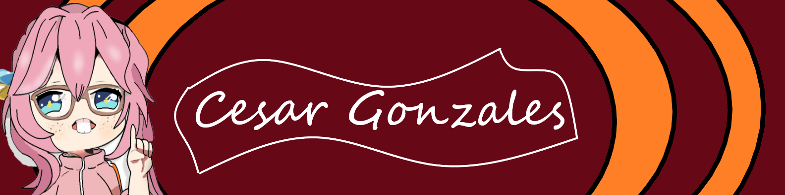

<!-- BANNER -->

<h2>👋 Hola, soy Cesar!</h2>

<!-- REDES (opcional) -->

 
 

<!-- IMAGEN LATERAL -->

<h3>🧑‍💻 Sobre mí</h3>

👨🏽‍💻 Actualmente trabajando en mi portafolio

📫 Correo: <a href="mailto:cesar.gonzales.t@tecsup.edu.pe">cesar.gonzales.t@tecsup.edu.pe</a>

 

<h3>🛠 Lenguajes y Herramientas</h3>

 
 

<h3>📊 GitHub Stats</h3>

<img src="https://github-readme-stats-git-masterrstaa-rickstaa.vercel.app/api?username=cesarjk78&show_icons=true&theme=radical&hide_border=true"
